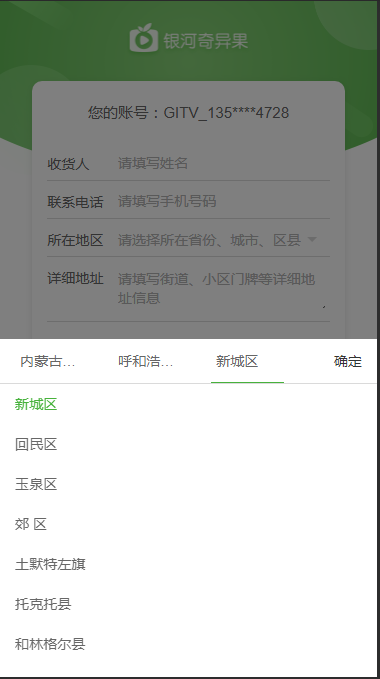

### 概述：
                
1. 可选择省市区三级联动的地区名；
2. 展示形式为带全屏模态遮罩浮层形式，点击页面遮罩空白处可关闭该组件，或者三级地名选择完整后点击组件内确定按钮关闭该组件，同时把三级地名以连接字符串形式传递到父层组件；
3. 支持传递默认省市区地名对组件进行初始化，若传递进来地名没有在当前数据源中找到，则忽略当前默认值进行初始化；

### 代码示例：
```vue
<template>
	<div class="container">
	  <cascader :isShow="isShow"
				:defaultValue="defaultValue"
				:quickCloseable="quickCloseable"
				:isSupportDefaultValue="isSupportDefaultValue"
				@on-hideToast="onHideToast"
				@on-confirm="onConfirm">
	  </cascader>
	</div>
</template>

<script>
	export default {
		name: 'eCascader',
		data() {
			return {
				isShow: false,
				quickCloseable: true,
				isSupportDefaultValue: true,
				defaultValue: {
					province: '内蒙古自治区',
					city: '呼和浩特市',
					town: '新城区',
				},
			};
		},
		methods: {
			onHideToast() {
				this.isShow = false;
			},
			onConfirm(data) {
				this.selectedData = JSON.stringify(data);
				this.selectedStr = data.province + data.city + data.town;
			},
		},
	};
</script>
```

### 效果图


### API：
##### props:
| 参数        | 说明   |  类型  | 可选值|  默认值  |
| :----    | :----:  :----:  |
| isShow      |  是否展示联动浮层, 默认不展示  |   boolean     |   -  |   false  |
| quickCloseable      | 点击遮罩是否可以关闭浮层，默认关闭  |   boolean     |   -  |   false  |
| isSupportDefaultValue      | 是否支持设定默认值，默认开启  |   boolean     |   -  |   true  |
| defaultValue      | 设定省市区的默认值  |   object     |   -  |   -  |
##### Events:
| 事件名称| 说明  | 回调参数  |
| :----  | :---- | :----:  |
|on-hideToast |  隐藏当前组件  |  - | 
| on-confirm      |  选择当前选定的省市区，传递到父层组件     | 形如： {"province":"山西省","city":"太原市","town":"小店区"} | 
