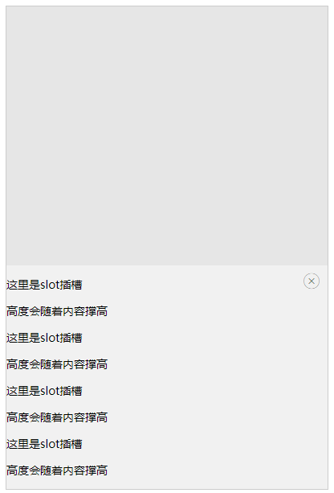

### 概述：
                
1. 满足某一指定条件后，从页面底部滑动展示出对应内容
2. 点击关闭按钮可以再次隐藏该内容
3. 组件内部由slot方式插入

### 代码示例：

```vue
<template>
	<div class="container">
		<Drawer :isShow="isShow"
						:quickCloseable="quickCloseable"
						@on-hideToast="onHideToast">
			<div slot="content">
				<p>这里是slot插槽</p>
				<p>高度会随着内容撑高</p>
				<p>这里是slot插槽</p>
				<p>高度会随着内容撑高</p>
				<p>这里是slot插槽</p>
				<p>高度会随着内容撑高</p>
				<p>这里是slot插槽</p>
				<p>高度会随着内容撑高</p>
			</div>
		</Drawer>
	</div>
</template>

<script>
	export default {
		name: 'eDrawer',
		data() {
			return {
				isShow: true,
				quickCloseable: true,
			};
		},
		methods: {
			onHideToast() {
				this.isShow = false;
			},
			showDrawer() {
				this.isShow = true;
			},
		},
	};
</script>
```

### 效果图


### API：
##### props:
| 参数        | 说明   |  类型  | 可选值|  默认值  |
| :----    | :----:  :----:  |
| isShow      | 是否展示当前隐藏在底部的toast浮层, 默认不展示  |   boolean     |   -  |   false  |
| quickCloseable      | 点击遮罩是否可以关闭浮层，默认关闭  |   boolean     |   -  |   false  |
##### Events:
| 事件名称| 说明  | 回调参数  |
| :----  | :---- | :----:  |
|on-hideToast |  隐藏当前组件  |  - | 

#####Slot

|name|说明|备注
|:-----|:---|:---|
|content|滑动组件内部插槽的内容|这个slot的内容高度会撑起slide组件高度|
