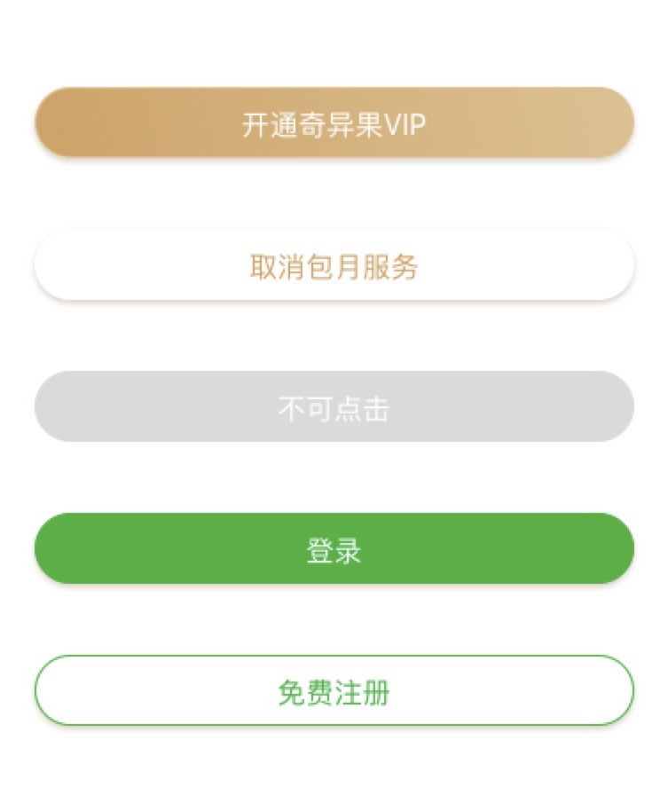
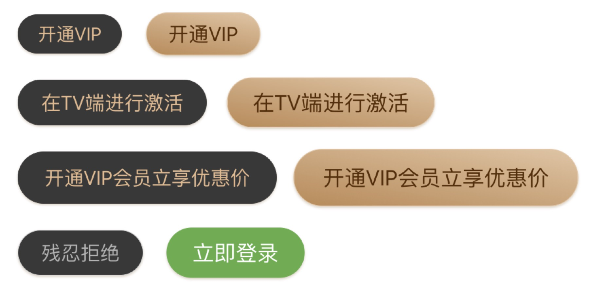

# Button按钮

## 概述

按钮，提供几种基础样式和尺寸，可自定义图标。

## 代码示例
```
<template>
  <Button type="defaultBtn" size="normal" @click="goToApply(e)">立即申请</Button>
<template>
<script>
  export default {
    data() {
      return {
      };
    }
    methods: {
       goToApply(){
          console.log('test Event:' + e.target);
       }
    }
  }
</script>
```

## 效果图
##### 手机端 button
/vui/other/

##### TV端 button


## API
### Props
#### 手机端 Button
| 属性     | 说明                       |  类型   | 默认值     | 可选值               | 必填 |
| :------- | :------------------------- | :-----: | :--------- | :------------------- | ---- |
| type     | 按钮显示样式 | String  | defaultBg | svip、vip、disabled、defaultBg、default   | 否   |
| styleObj | 自定义样式                 | String  | 空         | \                    | 否   |
#### TV端 Button
| 属性     | 说明                       |  类型   | 默认值     | 可选值               | 必填 |
| :------- | :------------------------- | :-----: | :--------- | :------------------- | ---- |
| type     | 按钮显示样式，有意义的命名 | String  | default | default、vip   | 否   |
| size     | 尺寸                       | String  | normal     | small, normal, large | 否   |
| focused     | 是否获焦                       | Boolean  | false     | true、false | 否   |
| styleObj | 自定义样式                 | String  | 空         | \                    | 否   |

### Events

| 事件  | 说明     | 参数 |
| :---- | :------- | :------- |
| on-click | 点击事件 | 函数     |

