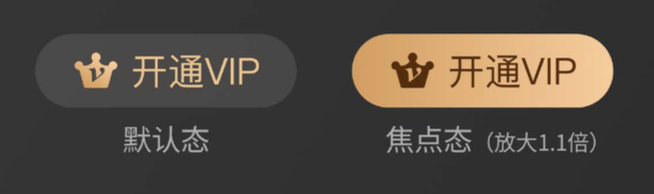
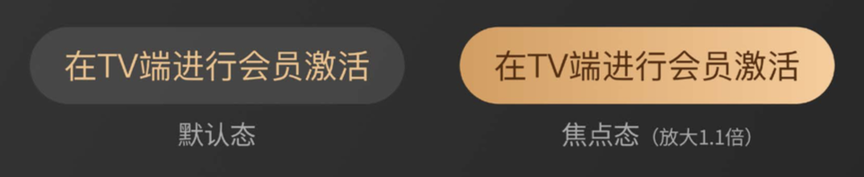
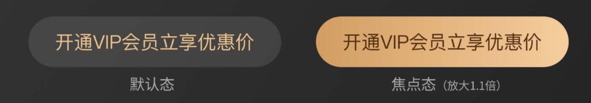
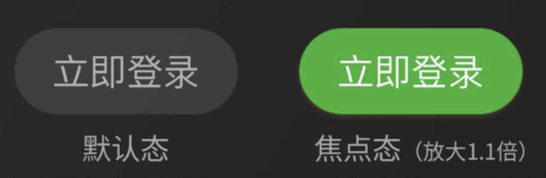

# Button按钮

## 概述

按钮，提供几种基础样式和尺寸，可自定义图标。

## 代码示例
```
<template>
  <Button type="defaultBtn" size="normal" @click="goToApply(e)">立即申请</Button>
<template>
<script>
  export default {
    data() {
      return {
      };
    }
    methods: {
       goToApply(){
          console.log('test Event:' + e.target);
       }
    }
  }
</script>
```
## 效果图
##### 1号 button 高度60px 字号28px 较小尺寸（size=small）

##### 2号 button 高度70px 字号30px 正常尺寸（size=normal）

##### 3号 button 高度80px 字号30px 最大尺寸（size=normal）

##### 非VIP样式按钮 type=defaultBtn （VIP样式 type=vipBtn）


## API

### Props

| 属性     | 说明                       |  类型   | 默认值     |        可选值        |
| :------- | :------------------------- | :-----: | :--------- | :------------------: |
| disabled | 禁用状态                   | Boolean | 空         |          \           |
| type     | 按钮显示样式，有意义的命名 | String  | defaultBtn |  defaultBtn, vipBtn  |
| size     | 尺寸                       | String  | normal     | small, normal, large |
| styleObj | 自定义样式                 | String  | 空         |          \           |

### Events

| 事件  | 说明     | 参数 |
| :---- | :------- | :------- |
| click | 点击事件 | 函数     |

